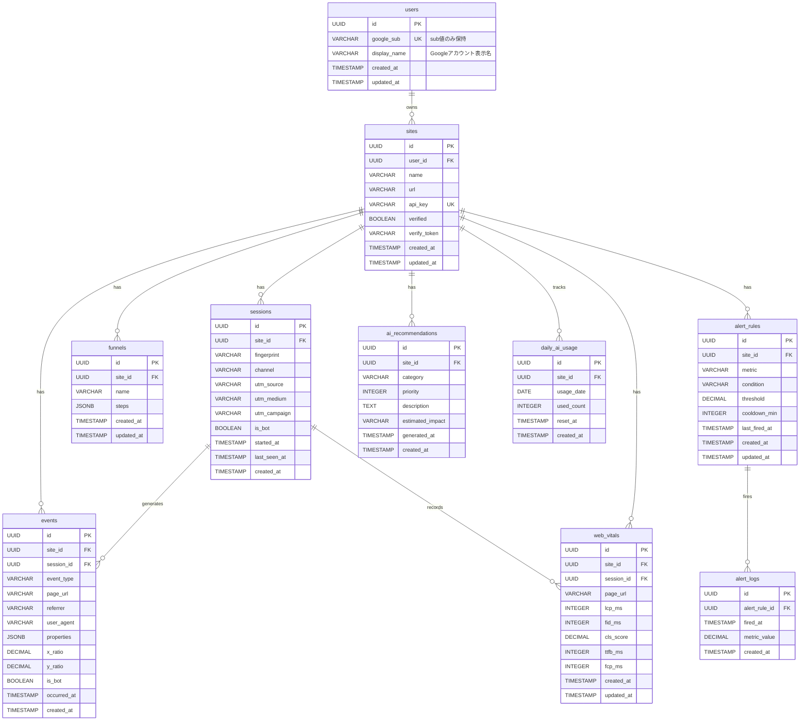

# ER 図

```mermaid
erDiagram
    users {
        UUID id PK
        VARCHAR google_sub UK "sub値のみ保持"
        VARCHAR display_name "Googleアカウント表示名"
        TIMESTAMP created_at
        TIMESTAMP updated_at
    }
    sites {
        UUID id PK
        UUID user_id FK
        VARCHAR name
        VARCHAR url
        VARCHAR api_key UK
        BOOLEAN verified
        VARCHAR verify_token
        TIMESTAMP created_at
        TIMESTAMP updated_at
    }
    sessions {
        UUID id PK
        UUID site_id FK
        VARCHAR fingerprint
        VARCHAR channel
        VARCHAR utm_source
        VARCHAR utm_medium
        VARCHAR utm_campaign
        BOOLEAN is_bot
        TIMESTAMP started_at
        TIMESTAMP last_seen_at
        TIMESTAMP created_at
    }
    events {
        UUID id PK
        UUID site_id FK
        UUID session_id FK
        VARCHAR event_type
        VARCHAR page_url
        VARCHAR referrer
        VARCHAR user_agent
        JSONB properties
        DECIMAL x_ratio
        DECIMAL y_ratio
        BOOLEAN is_bot
        TIMESTAMP occurred_at
        TIMESTAMP created_at
    }
    web_vitals {
        UUID id PK
        UUID site_id FK
        UUID session_id FK
        VARCHAR page_url
        INTEGER lcp_ms
        INTEGER fid_ms
        DECIMAL cls_score
        INTEGER ttfb_ms
        INTEGER fcp_ms
        TIMESTAMP created_at
        TIMESTAMP updated_at
    }
    funnels {
        UUID id PK
        UUID site_id FK
        VARCHAR name
        JSONB steps
        TIMESTAMP created_at
        TIMESTAMP updated_at
    }
    alert_rules {
        UUID id PK
        UUID site_id FK
        VARCHAR metric
        VARCHAR condition
        DECIMAL threshold
        INTEGER cooldown_min
        TIMESTAMP last_fired_at
        TIMESTAMP created_at
        TIMESTAMP updated_at
    }
    alert_logs {
        UUID id PK
        UUID alert_rule_id FK
        TIMESTAMP fired_at
        DECIMAL metric_value
        TIMESTAMP created_at
    }
    ai_recommendations {
        UUID id PK
        UUID site_id FK
        VARCHAR category
        INTEGER priority
        TEXT description
        VARCHAR estimated_impact
        TIMESTAMP generated_at
        TIMESTAMP created_at
    }
    daily_ai_usage {
        UUID id PK
        UUID site_id FK
        DATE usage_date
        INTEGER used_count
        TIMESTAMP reset_at
        TIMESTAMP created_at
    }

    users ||--o{ sites : "owns"
    sites ||--o{ sessions : "has"
    sites ||--o{ events : "has"
    sessions ||--o{ events : "generates"
    sessions ||--o{ web_vitals : "records"
    sites ||--o{ web_vitals : "has"
    sites ||--o{ funnels : "has"
    sites ||--o{ alert_rules : "has"
    alert_rules ||--o{ alert_logs : "fires"
    sites ||--o{ ai_recommendations : "has"
    sites ||--o{ daily_ai_usage : "tracks"
```
