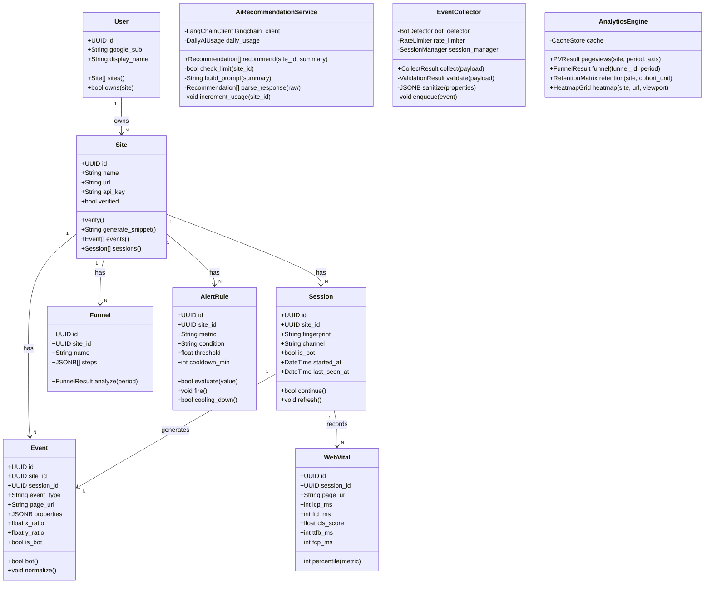

# クラス図

```mermaid
classDiagram
    class User {
        +UUID id
        +String google_sub
        +String display_name
        +Site[] sites()
        +bool owns(site)
    }
    class Site {
        +UUID id
        +String name
        +String url
        +String api_key
        +bool verified
        +verify()
        +String generate_snippet()
        +Event[] events()
        +Session[] sessions()
    }
    class Session {
        +UUID id
        +UUID site_id
        +String fingerprint
        +String channel
        +bool is_bot
        +DateTime started_at
        +DateTime last_seen_at
        +bool continue()
        +void refresh()
    }
    class Event {
        +UUID id
        +UUID site_id
        +UUID session_id
        +String event_type
        +String page_url
        +JSONB properties
        +float x_ratio
        +float y_ratio
        +bool is_bot
        +bool bot()
        +void normalize()
    }
    class WebVital {
        +UUID id
        +UUID session_id
        +String page_url
        +int lcp_ms
        +int fid_ms
        +float cls_score
        +int ttfb_ms
        +int fcp_ms
        +int percentile(metric)
    }
    class Funnel {
        +UUID id
        +UUID site_id
        +String name
        +JSONB[] steps
        +FunnelResult analyze(period)
    }
    class AlertRule {
        +UUID id
        +UUID site_id
        +String metric
        +String condition
        +float threshold
        +int cooldown_min
        +bool evaluate(value)
        +void fire()
        +bool cooling_down()
    }
    class AiRecommendationService {
        -LangChainClient langchain_client
        -DailyAiUsage daily_usage
        +Recommendation[] recommend(site_id, summary)
        -bool check_limit(site_id)
        -String build_prompt(summary)
        -Recommendation[] parse_response(raw)
        -void increment_usage(site_id)
    }
    class EventCollector {
        -BotDetector bot_detector
        -RateLimiter rate_limiter
        -SessionManager session_manager
        +CollectResult collect(payload)
        -ValidationResult validate(payload)
        -JSONB sanitize(properties)
        -void enqueue(event)
    }
    class AnalyticsEngine {
        -CacheStore cache
        +PVResult pageviews(site, period, axis)
        +FunnelResult funnel(funnel_id, period)
        +RetentionMatrix retention(site, cohort_unit)
        +HeatmapGrid heatmap(site, url, viewport)
    }

    User "1" --> "N" Site : owns
    Site "1" --> "N" Session : has
    Site "1" --> "N" Event : has
    Session "1" --> "N" Event : generates
    Session "1" --> "N" WebVital : records
    Site "1" --> "N" Funnel : has
    Site "1" --> "N" AlertRule : has
```
