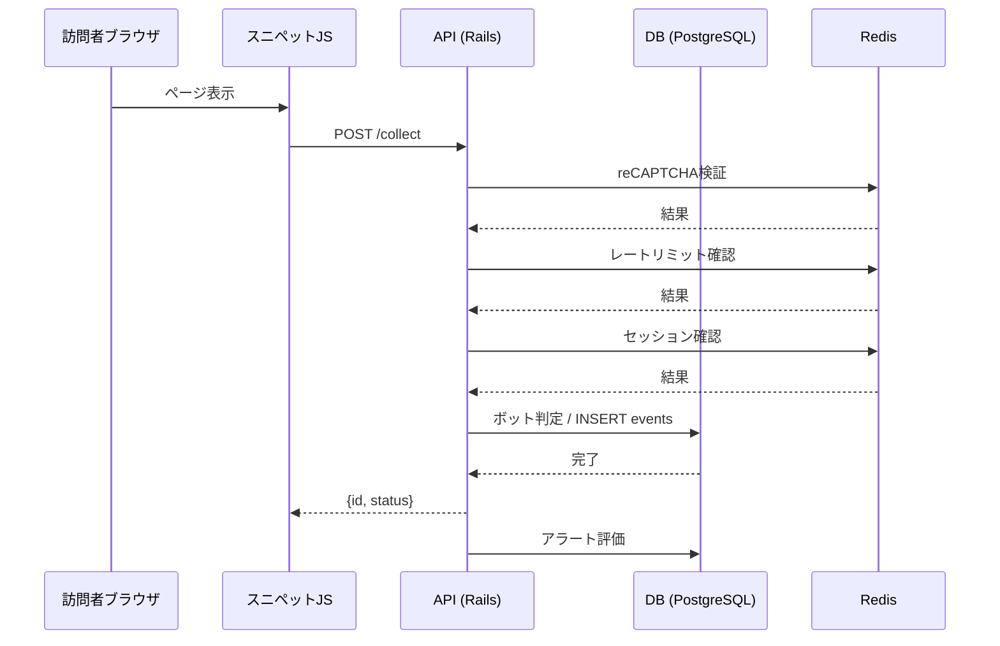
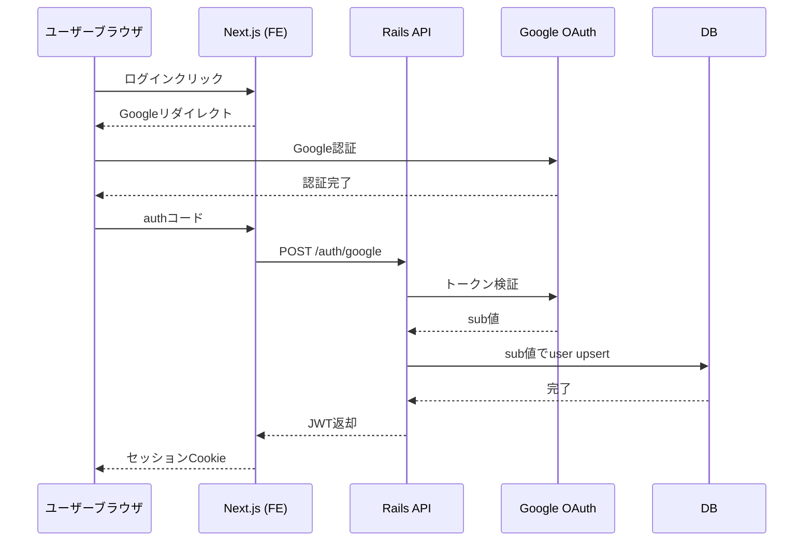
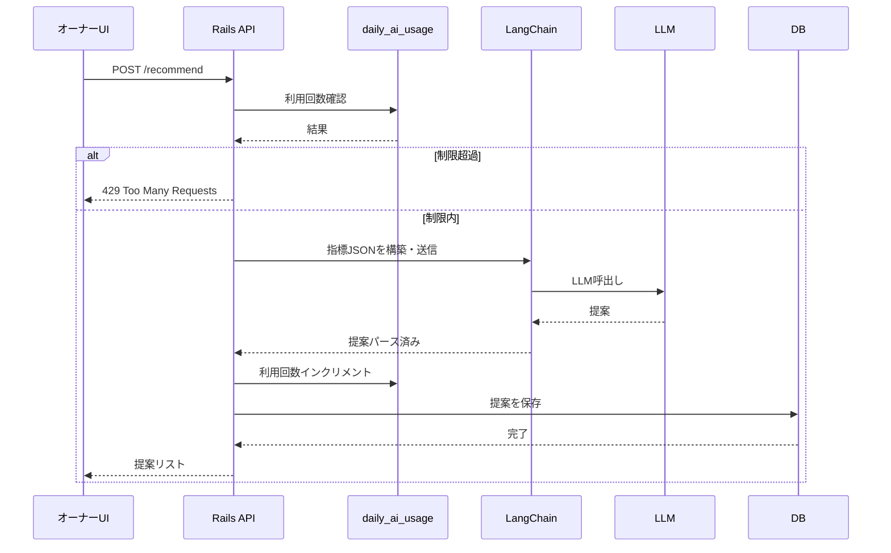

# シーケンス図

## イベント収集シーケンス

```mermaid
sequenceDiagram
    participant VB as 訪問者ブラウザ
    participant JS as スニペットJS
    participant API as API (Rails)
    participant DB as DB (PostgreSQL)
    participant Redis

    VB->>JS: ページ表示
    JS->>API: POST /collect
    API->>Redis: reCAPTCHA検証
    Redis-->>API: 結果
    API->>Redis: レートリミット確認
    Redis-->>API: 結果
    API->>Redis: セッション確認
    Redis-->>API: 結果
    API->>DB: ボット判定 / INSERT events
    DB-->>API: 完了
    API-->>JS: {id, status}
    API->>DB: アラート評価
```

## Google ログインシーケンス

```mermaid
sequenceDiagram
    participant UB as ユーザーブラウザ
    participant FE as Next.js (FE)
    participant API as Rails API
    participant GO as Google OAuth
    participant DB

    UB->>FE: ログインクリック
    FE-->>UB: Googleリダイレクト
    UB->>GO: Google認証
    GO-->>UB: 認証完了
    UB->>FE: authコード
    FE->>API: POST /auth/google
    API->>GO: トークン検証
    GO-->>API: sub値
    API->>DB: sub値でuser upsert
    DB-->>API: 完了
    API-->>FE: JWT返却
    FE-->>UB: セッションCookie
```

## AIレコメンデーションシーケンス

```mermaid
sequenceDiagram
    participant UI as オーナーUI
    participant API as Rails API
    participant DAU as daily_ai_usage
    participant LC as LangChain
    participant LLM
    participant DB

    UI->>API: POST /recommend
    API->>DAU: 利用回数確認
    DAU-->>API: 結果

    alt 制限超過
        API-->>UI: 429 Too Many Requests
    else 制限内
        API->>LC: 指標JSONを構築・送信
        LC->>LLM: LLM呼出し
        LLM-->>LC: 提案
        LC-->>API: 提案パース済み
        API->>DAU: 利用回数インクリメント
        API->>DB: 提案を保存
        DB-->>API: 完了
        API-->>UI: 提案リスト
    end
```
