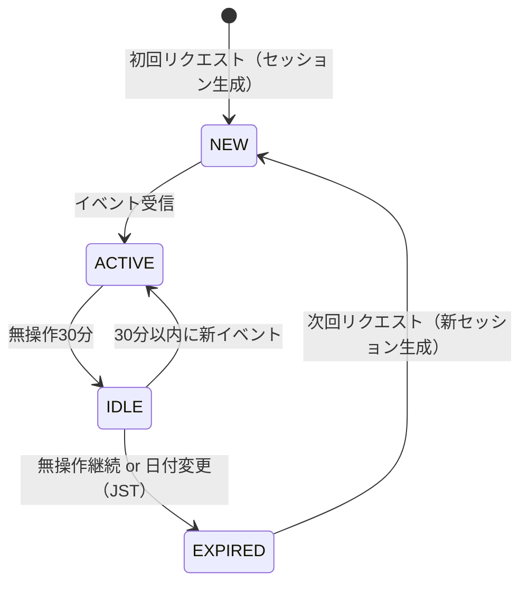
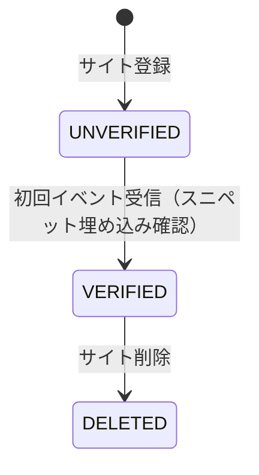
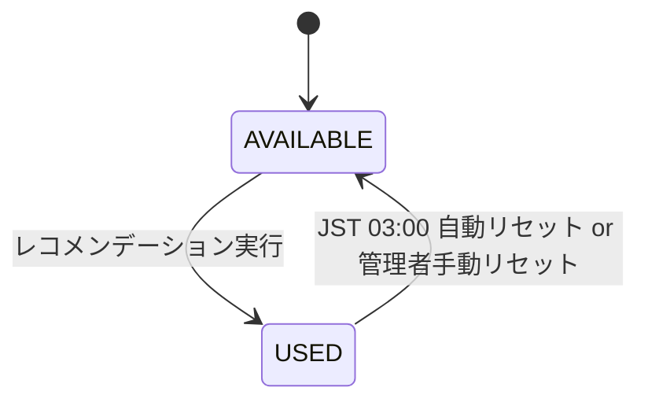
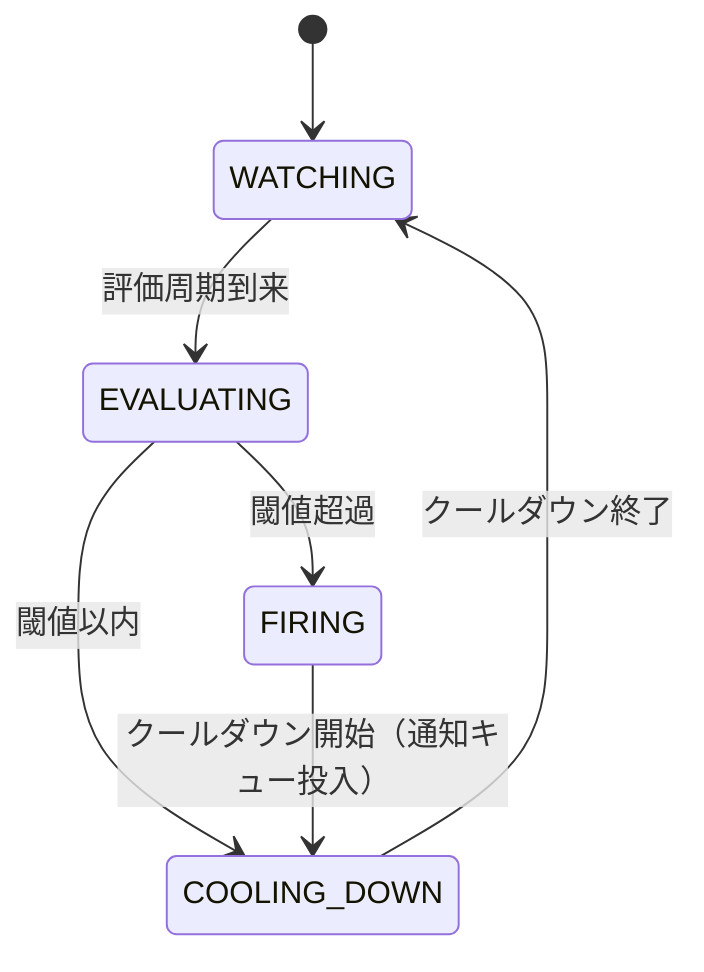

# 状態遷移図

## セッション状態遷移

```mermaid
stateDiagram-v2
    [*] --> NEW : 初回リクエスト（セッション生成）
    NEW --> ACTIVE : イベント受信
    ACTIVE --> IDLE : 無操作30分
    IDLE --> ACTIVE : 30分以内に新イベント
    IDLE --> EXPIRED : 無操作継続 or 日付変更（JST）
    EXPIRED --> NEW : 次回リクエスト（新セッション生成）
```

## サイト認証状態遷移

```mermaid
stateDiagram-v2
    [*] --> UNVERIFIED : サイト登録
    UNVERIFIED --> VERIFIED : 初回イベント受信（スニペット埋め込み確認）
    VERIFIED --> DELETED : サイト削除
```

## AIレコメンデーション利用制限状態遷移

```mermaid
stateDiagram-v2
    [*] --> AVAILABLE
    AVAILABLE --> USED : レコメンデーション実行
    USED --> AVAILABLE : JST 03:00 自動リセット or 管理者手動リセット
```

## アラートルール状態遷移

```mermaid
stateDiagram-v2
    [*] --> WATCHING
    WATCHING --> EVALUATING : 評価周期到来
    EVALUATING --> FIRING : 閾値超過
    EVALUATING --> COOLING_DOWN : 閾値以内
    FIRING --> COOLING_DOWN : クールダウン開始（通知キュー投入）
    COOLING_DOWN --> WATCHING : クールダウン終了
```
