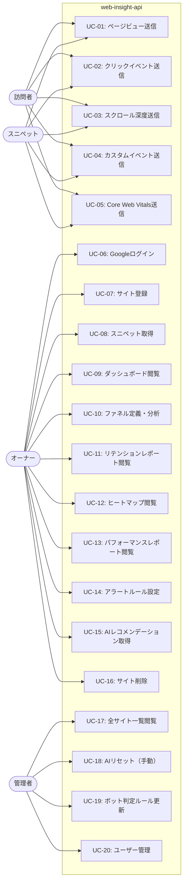

# ユースケース図

```mermaid
graph LR
    V([訪問者])
    O([オーナー])
    A([管理者])
    S([スニペット])

    subgraph system["web-insight-api"]
        UC01[UC-01: ページビュー送信]
        UC02[UC-02: クリックイベント送信]
        UC03[UC-03: スクロール深度送信]
        UC04[UC-04: カスタムイベント送信]
        UC05[UC-05: Core Web Vitals送信]
        UC06[UC-06: Googleログイン]
        UC07[UC-07: サイト登録]
        UC08[UC-08: スニペット取得]
        UC09[UC-09: ダッシュボード閲覧]
        UC10[UC-10: ファネル定義・分析]
        UC11[UC-11: リテンションレポート閲覧]
        UC12[UC-12: ヒートマップ閲覧]
        UC13[UC-13: パフォーマンスレポート閲覧]
        UC14[UC-14: アラートルール設定]
        UC15[UC-15: AIレコメンデーション取得]
        UC16[UC-16: サイト削除]
        UC17[UC-17: 全サイト一覧閲覧]
        UC18[UC-18: AIリセット（手動）]
        UC19[UC-19: ボット判定ルール更新]
        UC20[UC-20: ユーザー管理]
    end

    V --> UC01 & UC02 & UC03 & UC04 & UC05
    S --> UC01 & UC02 & UC03 & UC04 & UC05
    O --> UC06 & UC07 & UC08 & UC09 & UC10 & UC11 & UC12 & UC13 & UC14 & UC15 & UC16
    A --> UC17 & UC18 & UC19 & UC20
```
